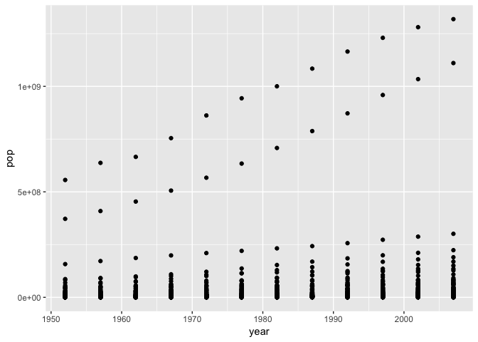

# Heading

## Subheading

### Smaller Heading

*This is some formatting*

**Some other formatting**

[A hyperlink](https://google.com)

- A bulleted list
- Another list item

1. This is a numbered list with bullets embedded
  - First entry
  - Second entry
  - Third entry
1. This will hopefully be number 2

~~This was a bad item~~


```r
library("gapminder")
library("ggplot2")
suppressPackageStartupMessages(library(tidyverse))
data(gapminder)
head(gapminder)
```


```r
ggplot(data = gapminder, mapping = aes(x = gdpPercap, y = lifeExp)) + geom_point()
```

<!-- -->

Here, we see the plot for life expectancy as time progresses.


```r
ggplot(data = gapminder, mapping = aes(x = year, y = lifeExp)) + geom_point()
```

<!-- -->

The largest population of any country in this data set is 1318683096.


The maximum life expectancy in Iceland is 81.757.


For Tanzania, the average life expectancy is 47.9123333, while the standard deviation is 3.6024352.


```r
ggplot(data = gapminder, mapping = aes(x = year, y = pop)) + geom_point()
```

<!-- -->

Here is some more text that I am adding.
